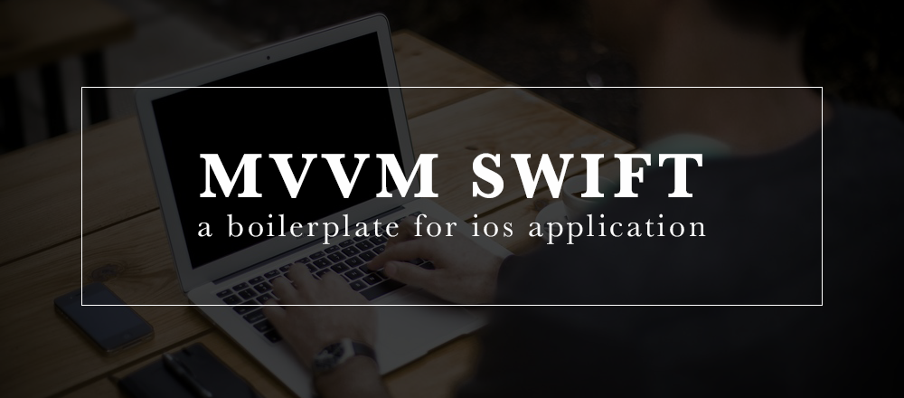

IOS MVVM Project Boilerplate
============================

*Every app we build is unique, but best practices should be consistent between projects. Here on [AsianTech](http://asiantech.vn) iOS team, we’ve been baking more and more of those best practices into a template we use for starting any new project.
This ensures consistency in our work: we don’t repeat mistakes, we use known libraries that we all have some experience with, and any one of us can get up to speed on a new project quickly because things are organized in a way we recognize.*

Testimonials
------------

> **“Nice! That README alone is already gold!”**
> — Mr Huy Dinh Q.

> **“Awesome. Simply awesome.”**
> — Mr Tien Le P.

> **“I'm using it for a year now and many projects, it's an awesome boilerplate and the project is well maintained!”**
> — Mr Dai Ho V.

Table of Contents
-----------------

- [Prerequisites](#prerequisites)
- [Project Structure](#project-structure)
- [Workspace Preparing](#workspace-preparing)
- [Obtaining the Defines](#obtaining-the-defines)
- [List of Frameworks](#list-of-frameworks)
- [Useful Tools and Resources](#useful-tools-and-resources) <!-- - [FAQ](#faq) -->
- [Beta Deployment](#beta-deployment) <!-- - [Changelog](#changelog) -->
- [Contributing](contributing)

## Prerequisites

- [MacOS Sierra (10.12.x)](https://www.apple.com/lae/macos/sierra/)
- [Xcode 8.3.x](https://developer.apple.com/download/) ~ Swift 3.1
- [CocoaPods 1.2.x](https://cocoapods.org/#install)

## Project Structure

| Name | Description |
| --- | --- |
| **Define**/ | The most time static values will be put here, such as third party keys, colors, fonts... |
| **Define**/App.swift | App or third party keys/credientials will be defined here |
| **Define**/String.swift | Localizable strings will be defined here |
| **Define**/Color.swift | Colors will be defined here |
| **Define**/Font.swift | Fonts will be defined here |
| **View**/ | Everything relative directly to UI |
| **View**/Base/ | Base classes for view controller, popup controller... |
| **View**/Controls/ | Custom controls: label, button, cell... |
| **View**/Controllers/ | View controllers |
| **ViewModel**/ | Data holding & logic handling for view controller |
| **Model**/ | Business objects and business logic will be put here |
| **Model**/API/ | API request will be handled here |
| **Model**/Schema/ | ORM objects will be defined here |
| **Library**/ | Helper, Utils, Extension... or frameworks which cannot be put in CocoaPods (ex: modified, no podspec found...) |
| **Resources**/ | Image, video, audio, font, `Localizable.strings`... |
| **Supports**/ | Application info, target configuration, bridging... |

**Note:** You should place your controllers in `Controllers` directory with a nested folder structure.

## Workspace Preparing

- `./scripts/install` - this script will install
    - [brew](https://github.com/Homebrew/brew) command & necessary formulas
    - [rbenv](https://github.com/rbenv/rbenv) command & necessary gems
    - [pod](https://cocoapods.org/) command & project's dependences

- `open *.xcw*` - this command will open generated workspace with Xcode.

## Obtaining the Defines

To use any of the included APIs or third parties, you will need to obtain appropriate credentials: Client ID, Client Secret, API Key, or Username & Password... You will need to go through each provider to generate new credentials.

> Don't forget to update all API keys with *your credentials* when you are ready to deploy an app.

## List of Frameworks

| Framework | Description |
| ------------------------------- | --------------------------------------------------------------------- |
| MVVM-Swift | MVVM Architect for iOS Application. |
| SVProgressHUD | A clean and lightweight progress HUD for your iOS and tvOS app. |
| IQKeyboardManagerSwift | Codeless drop-in universal library allows to prevent issues of keyboard sliding up and cover UITextField/UITextView. Neither need to write any code nor any setup required and much more. |
| LGSideMenuController | iOS view controller, shows left and right views by pressing button or gesture. |
| RealmS | Realm + ObjectMapper. |
| ObjectMapper | Simple JSON Object mapping written in Swift. Please fix this version to 2.2.6 now. |
| SwiftyJSON | The better way to deal with JSON data in Swift. |
| Alamofire | Elegant HTTP Networking in Swift. |
| AlamofireNetworkActivityIndicator | Controls the visibility of the network activity indicator on iOS using Alamofire. |
| SwiftDate | The best way to manage Dates and Timezones in Swift. |
| SAMKeychain | Simple Objective-C wrapper for the keychain that works on Mac and iOS. |
| KeychainAccess | ESimple Swift wrapper for Keychain that works on iOS, watchOS, tvOS and macOS. |
| SwiftLint | A tool to enforce Swift style and conventions. |
| AsyncSwift | Syntactic sugar in Swift for asynchronous dispatches in Grand Central Dispatch. |
| SwiftUtils | Swift shorthand. |
| SwiftyUserDefaults | Modern Swift API for NSUserDefaults. |
| DeviceKit | DeviceKit is a value-type replacement of UIDevice. |
| Fabric/Crashlytics | Crash reporting & beta deployment. |

## Useful Tools and Resources

- [CocoaPods](https://cocoapods.org/) - CocoaPods is a dependency manager for Swift and Objective-C Cocoa projects. It has over 33 thousand libraries and is used in over 2.2 million apps. CocoaPods can help you scale your projects elegantly.
- [fastlane](https://docs.fastlane.tools/) - The easiest way to automate building and releasing your iOS and Android apps.
- [Swimat](https://github.com/Jintin/Swimat) - An Xcode formatter plug-in to format your Swift code.
- [SwiftLint](https://github.com/realm/SwiftLint) - A tool to enforce Swift style and conventions.
- [Ray Wenderlich](https://www.raywenderlich.com/) - The largest collection of Swift & iOS video tutorials anywhere.
- [design+code](https://designcode.io/iosdesign-guidelines) - iOS 10 Design Guidelines for iPhone and iPad.
- [Fabric](https://docs.fabric.io/apple/fabric/overview.html) - Fabric is a platform that helps your mobile team build better apps, understand your users, and grow your business.
- [TestFlight](https://help.apple.com/itunes-connect/developer/#/devdc42b26b8) - TestFlight beta testing lets you distribute beta builds of your app to testers and collect feedback.
- [DeployGate](https://deploygate.com/docs/ios_sdk?locale=en) - DeployGate makes it easy to share your in-development iOS and Android apps, allowing developers to seamlessly progress through the prototyping, development, testing, and marketing stages of app distribution.

<!--
## FAQ

### Question?
Answer.
-->

<!--
## Changelog

### 1.0.0 (June 20, 2017)
The first version.
-->

## Contributing

If something is unclear, confusing, or needs to be refactored, please let me know. Pull requests are always welcome, but due to the opinionated nature of this project, I cannot accept every pull request. Please open an issue before submitting a pull request. This project uses [RayWenderlich Swift Style Guide](https://github.com/raywenderlich/swift-style-guide) with a
few minor exceptions. If you are submitting a pull request that involves Pug templates, please make sure you are using *spaces*, not tabs.
